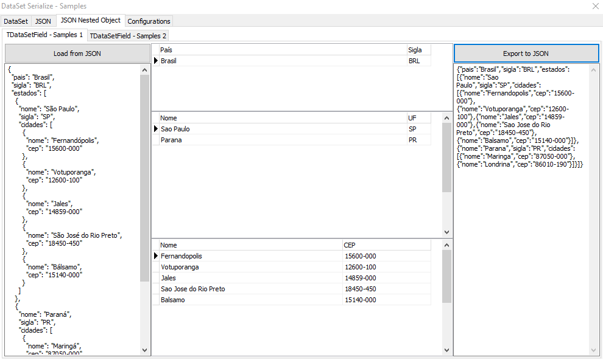
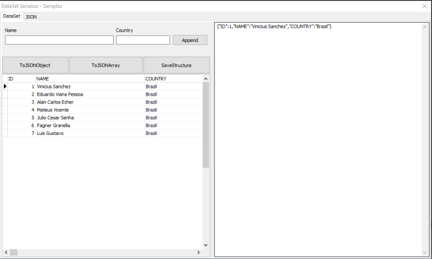
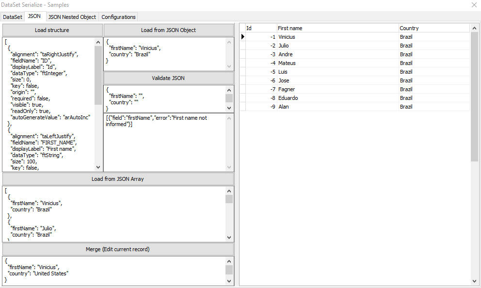

# DataSet Serialization for Delphi


This component is a JSON serializer for the DataSet component of Delphi. Allows you to convert JSON to DataSet, DataSet to JSON, validate JSON, and export and load the structure of DataSet fields in JSON format.
 
## Prerequisites
 * `[Optional]` For ease I recommend using the [**Boss**](https://github.com/HashLoad/boss) (Dependency Manager for Delphi) for installation
 
## Installation using Boss (dependency manager for Delphi applications)
```
boss install github.com/viniciussanchez/dataset-serialize
```

## Manual Installation
Add the following folders to your project, in *Project > Options > Resource Compiler > Directories and Conditionals > Include file search path*
```
../dataset-serialize/src
../dataset-serialize/src/core
../dataset-serialize/src/helpers
../dataset-serialize/src/interfaces
../dataset-serialize/src/providers
../dataset-serialize/src/types
```

## Getting Started
You need to use DataSet.Serialize.Helper
```pascal
uses DataSet.Serialize.Helper;
```

#### DataSet to JSON Object
```pascal
var
  JSONObject: TJSONObject;
begin
  JSONObject := qrySample.ToJSONObject;
end;
```  

#### DataSet to JSON Array
```pascal
var
  JSONArray: TJSONArray;
begin
  JSONArray := qrySample.ToJSONArray;
end;
``` 

#### Save the field structure
```pascal
var
  JSONArray: TJSONArray;
begin
  JSONArray := qrySample.SaveStructure;
end;
``` 

Returns:

``` 
[
  {
    "FieldName": "ID",
    "DisplayLabel": "Id",
    "DataType": "ftInteger",
    "Size": 0,
    "Key": false,
    "Origin": "",
    "Required": false,
    "Visible": true,
    "ReadOnly": true,
    "AutoGenerateValue": "arAutoInc"
  },
  {
    "FieldName": "NAME",
    "DisplayLabel": "Name",
    "DataType": "ftString",
    "Size": 100,
    "Key": false,
    "Origin": "",
    "Required": true,
    "Visible": true,
    "ReadOnly": false,
    "AutoGenerateValue": "arNone"
  }
]
``` 

#### Load the field structure
```pascal
const 
  STRUCTURE = 
    '[
      {
        "FieldName": "ID",
        "DisplayLabel": "Id",
        "DataType": "ftInteger",
        "Size": 0,
        "Key": false,
        "Origin": "",
        "Required": true,
        "Visible": true,
        "ReadOnly": true,
        "AutoGenerateValue": "arAutoInc"
      },
      {
        "FieldName": "NAME",
        "DisplayLabel": "Name",
        "DataType": "ftString",
        "Size": 100,
        "Key": false,
        "Origin": "",
        "Required": true,
        "Visible": true,
        "ReadOnly": false,
        "AutoGenerateValue": "arNone"
      }
    ]';
var
  JSONArray: TJSONArray;
begin
  JSONArray := TJSONObject.ParseJSONValue(TEncoding.ASCII.GetBytes(STRUCTURE),0) as TJSONArray;
  qrySample.LoadStructure(JSONArray);
end;
``` 

#### Load from JSON
```pascal
const 
  JSON = '{"NAME":"Vinicius Sanchez","COUNTRY":"Brazil"}';
var
  JSONObject: TJSONObject;
begin
  JSONObject := TJSONObject.ParseJSONValue(TEncoding.ASCII.GetBytes(JSON),0) as TJSONObject;
  qrySample.LoadFromJSON(JSONObject); // or JSONArray
end;
``` 

#### Merge (Edit current record)
```pascal
const 
  JSON = '{"NAME":"Vinicius","COUNTRY":"United States"}';
var
  JSONObject: TJSONObject;
begin
  JSONObject := TJSONObject.ParseJSONValue(TEncoding.ASCII.GetBytes(JSON),0) as TJSONObject;
  qrySample.MergeFromJSONObject(JSONObject);
end;
``` 

#### Validate JSON

Scroll through all DataSet fields by checking the fields that are required. If the field is required and has not been entered in JSON, it is added in the Array.

```pascal
const 
  JSON_VALIDATE = '{"COUNTRY":"Brazil"}';
var
  JSON: TJSONObject;
begin
  JSON := TJSONObject.ParseJSONValue(TEncoding.ASCII.GetBytes(JSON_VALIDATE),0) as TJSONObject;
  mmJSONArrayValidate.Lines.Text := mtJSON.ValidateJSON(JSON, TLanguageType.ptBR).ToString;
end;
``` 

Returns:

``` 
[
  {
    "field": "ID",
    "error": "Id não foi informado(a)"
  },
  {
    "field": "NAME",
    "error": "Name não foi informado(a)"
  }
]
``` 

###### The default language is English (TLanguageType.enUS);

## JSON Nested Object

Load JSON Nested Object in a simple way:
* Binds the field created in the master dataset in the `DataSetField` property of the secondary dataset.

See the sample:



## Another samples




