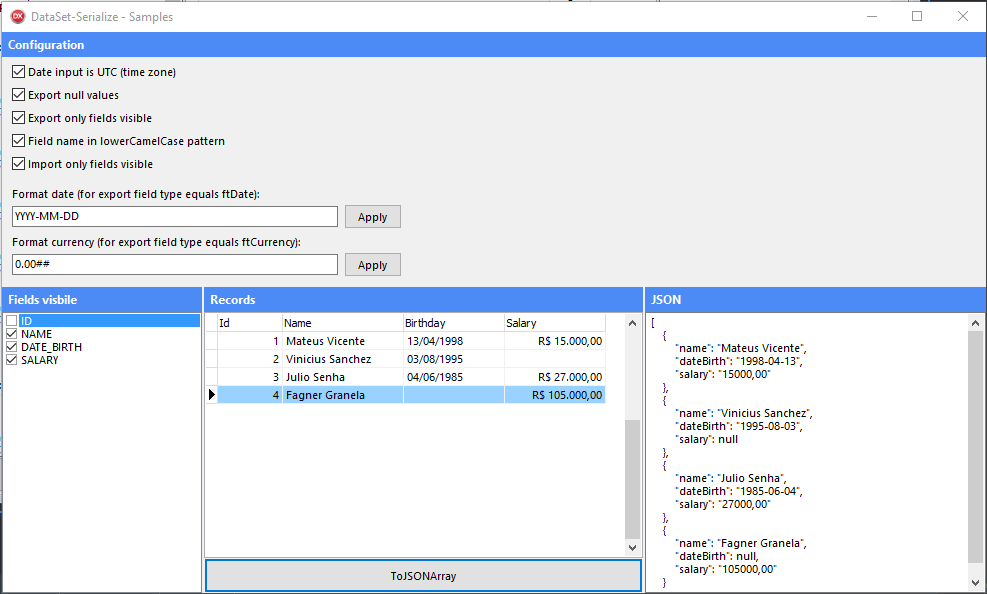

<a href="https://github.com/viniciussanchez/dataset-serialize/blob/master/img/dataset-serialize.png">
  
</a>  

# DataSet Serialize for Delphi and Lazarus (FPC)


DataSet Serialize is a set of features to make working with JSON and DataSet simple. It has features such as exporting or importing records into a DataSet, validate if JSON has all required attributes (previously entered in the DataSet), exporting or importing the structure of DataSet fields in JSON format. In addition to managing nested JSON through master detail or using TDataSetField (you choose the way that suits you best). All this using class helpers, which makes it even simpler and easier to use.
 
## Prerequisites for Delphi
 * `[Optional]` For ease I recommend using the [**Boss**](https://github.com/HashLoad/boss) (Dependency Manager for Delphi) for installation, simply by running the command below on a terminal (Windows PowerShell for example):
```
boss install github.com/viniciussanchez/dataset-serialize
```

## Manual Installation for Delphi
If you choose to install manually, simply add the following folders to your project, in *Project > Options > Resource Compiler > Directories and Conditionals > Include file search path*
```
../dataset-serialize/src
```

## Getting Started
All features offered by DataSet Serialize are located in the class helper in unit DataSet.Serialize. To get your project started, simply add your reference where your functionality is needed. Here's an example:
```pascal
uses DataSet.Serialize;
```
Let's now look at each feature, its rules and peculiarities, to deliver the best to all users.

## DataSet to JSON
Creating a JSON object with information from a DataSet record seems like a very simple task. But that task just got easier. DataSet Serialize has two functions for this, namely ToJSONObject and ToJSONArray. Let's look at the use of the functions:

```pascal
var
  LJSONArray: TJSONArray;
  LJSONObject: TJSONObject;  
begin
  LJSONObject := qrySamples.ToJSONObject(); // export a single record
  LJSONArray := qrySamples.ToJSONArray(); // export all records 
end;
```  
What is the difference between the two functions? ToJSONObject will only convert the current DataSet record to a TJSONObject. ToJSONArray will convert to a TJSONArray all the records of the DataSet and not just the selected record.

**Parameters**
* `AChildRecords` - Indicates whether or not to export child records (via master detail or TDataSetField).
* `AOnlyUpdatedRecords` - Indicates whether to export only records that have been modified (records added, changed, or deleted). This feature is only available when using FireDAC. The CachedUpdates property must be True;

**ToJSONObject**
* If the DataSet is empty or not assigned, a blank JSON object (`{}`) will be returned;
* The field that does not have the visible (True) property will be ignored. 
* The attribute name in JSON will always be the field name in lower case, even if the field name is in upper case;
* If the field is of type TDataSetField, a nested JSON is generated (JSONObject if it is just a child record, or JSONArray if it is more than one). The most suitable way for this type of situation is to create a master detail;
* All child records will be exported as a JSONArray;
* When using the AOnlyUpdatedRecords parameter of the ToJSONObject or ToJSONArray method, the JSON item is added to an "object_state" property responsible for defining what happened to the record (deleted, included or changed);
* When a JSON array is created to represent a nested JSON using Master Detail, the DataSet name will be the name of the generated JSON attribute. There is a rule where if the DataSet name starts with qry (query) or mt (memtable), these initials are ignored, leaving only the rest as the attribute name in JSON.

**ToJSONArray**
* If the DataSet is empty or not assigned, a blank JSON array (`[]`) will be returned;  
* Follows the same rules as ToJSONObject;

## Save and load structure 
A not very useful but important feature is SaveStructure and LoadStructure. As the name already said, it is possible to save the entire structure of fields configured in the DataSet and also load a structure in JSON format. Here's an example of how to load and export DataSet fields:

```pascal
var
  LJSONArray: TJSONArray;
begin
  LJSONArray := qrySamples.SaveStructure;
  qrySamples.LoadStructure(LJSONArray, True);
end;
``` 

The following properties are controlled: 

`Alignment, FieldName, DisplayLabel, DataType, Size, Key, Origin, Required, Visible, ReadOnly, and AutoGenerateValue`;

**Parameters**
* `AOwns` - Indicates who is responsible for destroying the passed JSON as a parameter.

**SaveStructure**
* If the field count of DataSet equals zero, a blank JSON array (`[]`) will be returned; 

**LoadStructure**
* DataSet cannot be activated and Must not have fields defined;

## Validate JSON
The ValidateJSON function is very useful when we want to validate on a server for example if the JSON we received in the request has all the required information. Practically, all fields in the DataSet are traversed, checking if the required fields were entered in JSON. If the field is required and has not been entered in JSON, it will be added to the JSON Array returned by the function. See the example below:

```pascal
begin
  LJSONArray := qrySamples.ValidateJSON('{"country":"Brazil"}');
end;
``` 

Upon receiving `{"country": "Brazil"}`, assuming our DataSet has 3 fields (ID, FIRST_NAME, COUNTRY), and the ID and FIRST_NAME field are required, the following will be returned:

``` 
[{"field":"id","error":"Id not informed"},{"field":"firstName","error":"Name not informed"}]
``` 

**Parameters**
* `ALang` - Responsible for changing the language used in the assembly of messages (default is English);
* `AOwns` - Indicates who is responsible for destroying the passed JSON as a parameter;

**ValidateJSON**
* If JSON is not assigned or fields count equals zero an exception is raised.
* The default language of messages is English; 
* Even if all required fields are entered, an empty JSON array (`[]`) is returned;     
* A required field must have its Required property equal to True.
* The DisplayLabel property can be used to customize the message;

## Load from JSON
DataSet Serializa allows you to load a DataSet with a JSONObject, JSONArray and even a nested JSON all summarized in one method: LoadFromJSON(). Here's an example of how to use it:
```pascal
begin
  qrySamples.LoadFromJSON('{"firstName":"Vinicius Sanchez","country":"Brazil"}');
end;
``` 

**Parameters**
* `AOwns` - Indicates who is responsible for destroying the passed JSON as a parameter;

**LoadFromJSON**
* If JSON or DataSet has not been assigned, nothing will be done;
* If DataSet is not activated and is not a TFDMemTable class, nothing will be done;
* If the DataSet is of type TFDMemTable, it's not active and fields count equals zero, the fields will be created according to the JSON need. The DataType will be equal to ftString and Size equal to 4096;
* When the "object_state" property is in JSON, the following validations are made:
  * If equal to INSERTED, an Append is performed on the DataSet;
  * If it is MODIFIED or DELETED, a Locate is made in the DataSet to find the record to be manipulated. If the registry is not found, nothing will be done. To execute Locate, a search for Key Fields is done within JSON;
  * If MODIFIED equals the Edit method of the DataSet;
  * If DELETED equals the Delete method of the DataSet;
* If the "object_state" property is not found in JSON, then the Append method is called;
* When loading a DataSet with JSON, fields that are ReadOnly or Visible(False) are ignored;
* If an attribute is not found in JSON with the field name (not case sensitive), or it is nullo, the field is ignored (nullo / empty);
* When loading a DataSet with a JSON containing nested JSON using Master Detail, by convention, the name of the child DataSet is expected to be the same as the JSON attribute name that represents the list of children to be loaded. The name of the child DataSet may still have the initials qry (query) or mt (memtable), as these will be ignored;

## Merge from JSON
With DataSet Serialize you can still change the DataSet registration simply by using MergeFromJSONObject. The function is similar to LoadFromJSON. An example of use is for REST servers when the verb used in the request is PUT (not necessarily), in this case we do not want to include a new record but to change the current record.

```pascal
begin
  qrySamples.MergeFromJSONObject('{"firstName":"Vinicius","country":"United States"}');
end;
``` 

**Parameters**
* `AOwns` - Indicates who is responsible for destroying the passed JSON as a parameter;

**MergeFromJSONObject**
* Same as LoadFromJSON validations;

## Configurations
You can customize some features of DataSet-Serialize:
* Date input is UTC (time zone)
```pascal
TDataSetSerializeConfig.GetInstance.DateInputIsUTC := True;
```
* Export null values
```pascal
  TDataSetSerializeConfig.GetInstance.Export.ExportNullValues := True;
```
* Export only fields visible
```pascal
  TDataSetSerializeConfig.GetInstance.Export.ExportOnlyFieldsVisible := True;
```
* Export child DataSet as JSON object (when you have only 1 record)
```pascal
  TDataSetSerializeConfig.GetInstance.Export.ExportChildDataSetAsJsonObject := False;
```
* Import only fields visible
```pascal
  TDataSetSerializeConfig.GetInstance.Import.ImportOnlyFieldsVisible := True;
```
* Case name definition
```pascal
  // cndNone, cndLower, cndUpper, cndLowerCamelCase, cndUpperCamelCase
  TDataSetSerializeConfig.GetInstance.CaseNameDefinition := cndLowerCamelCase;
  
  cndNone:
  [{"MOB_ICADASTRO":11795,"MOB_EMI_REG":6,"CODIGODOCLIENTE":1,"CDOCUMEN1":"999999"}]
  
  cndLower:
  [{"mob_icadastro":11795,"mob_emi_reg":6,"codigodocliente":1,"cdocumen1":"999999"}]

  cndUpper:
  [{"MOB_ICADASTRO":11795,"MOB_EMI_REG":6,"CODIGODOCLIENTE":1,"CDOCUMEN1":"999999"}]

  cndLowerCamelCase :
  [{"mobIcadastro":11795,"mobEmiReg":6,"codigodocliente":1,"cdocumen1":"999999"}]

  cndUpperCamelCase::
  [{"MobIcadastro":11795,"MobEmiReg":6,"Codigodocliente":1,"Cdocumen1":"999999"}]  
```
* Format date (for export field type equals ftDate)
```pascal
  TDataSetSerializeConfig.GetInstance.Export.FormatDate := 'YYYY-MM-DD';
```
* Format currency (for export field type equals ftCurrency)
```pascal
  TDataSetSerializeConfig.GetInstance.Export.FormatCurrency := '0.00##';
```
* Define DataSet prefixes
```pascal
  TDataSetSerializeConfig.GetInstance.DataSetPrefix := ['mt', 'qry'];
```

## Samples
Check out our sample project for each situation presented above in operation. If you have any questions or suggestion, please contact, make your pull request or create an issue.



## Team

This project is maintained by the following person(s) and a bunch of [awesome contributors](https://github.com/viniciussanchez/dataset-serialize/graphs/contributors).

[](https://github.com/viniciussanchez) | [](https://github.com/mateusvicente100)
--- | ---
[Vinicius Sanchez](https://github.com/viniciussanchez) | [Mateus Vicente](https://github.com/mateusvicente100)

## License

`DataSet-Serialize` is free and open-source software licensed under the [MIT License](https://github.com/viniciussanchez/dataset-serialize/blob/master/LICENSE).

:point_right: *Alone we go faster. Together we go further.*
